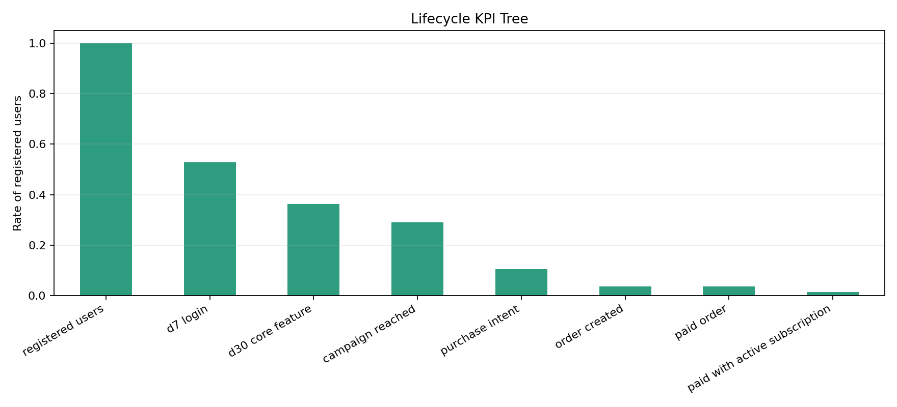
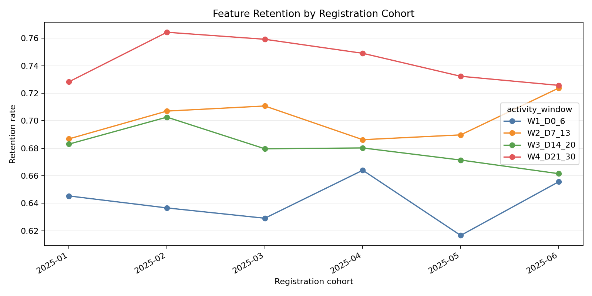
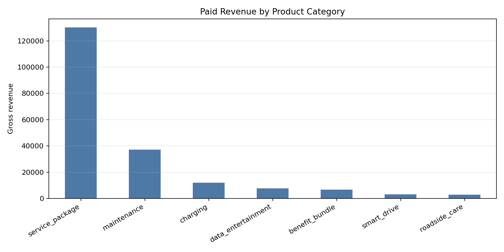
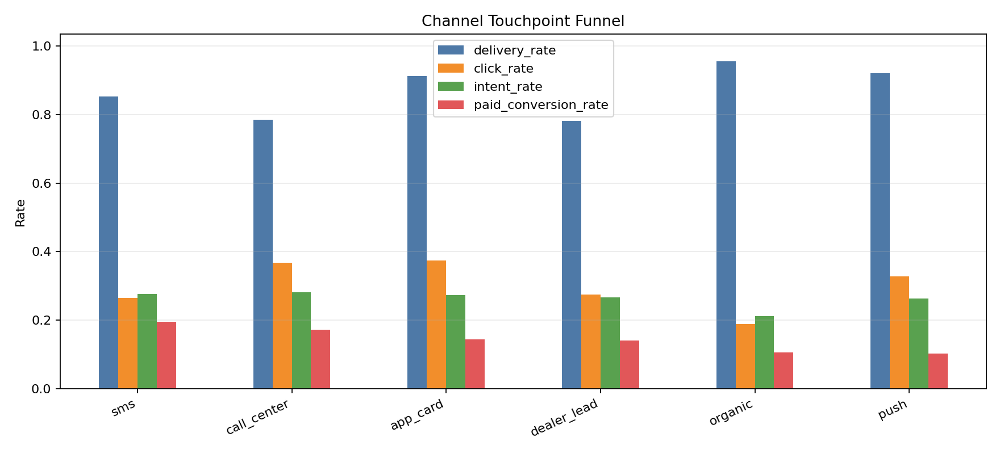
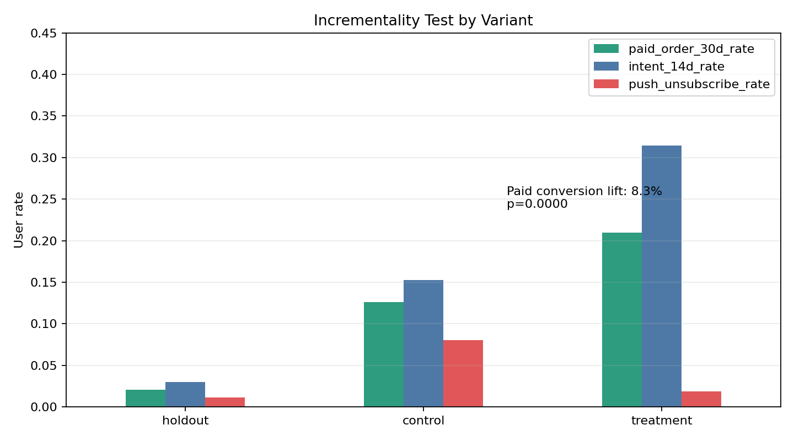
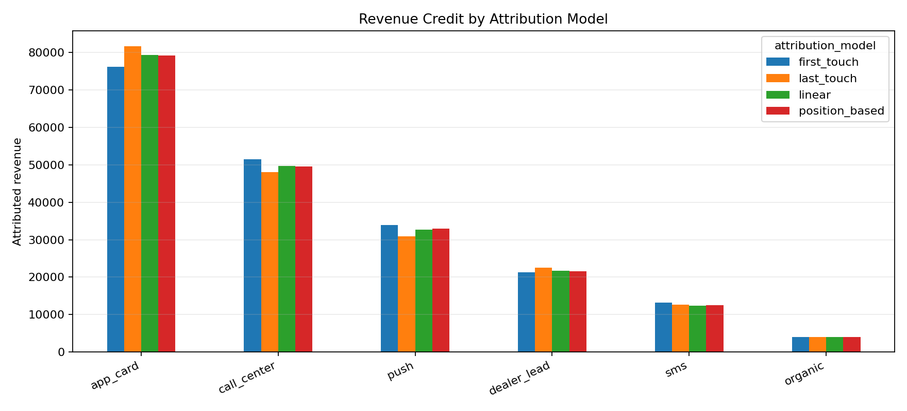
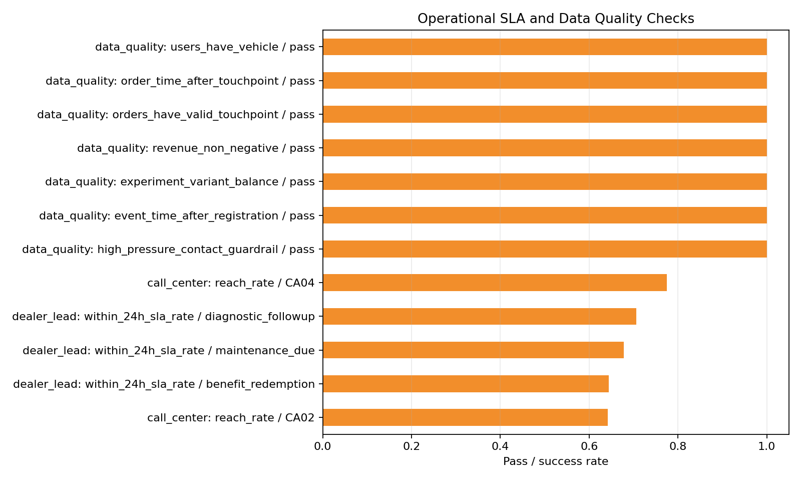

# 车联网车主 App 增长分析案例报告

## 核心结论

这是一个完全基于合成数据的车联网车主 App 增长分析项目，模拟车主生命周期激活、多产品商业化、多触点触达、增量实验、归因分析、意向模型输入和运营质量诊断。

- 北极星指标，30 日服务活跃率：**77.2%**。
- 严格生命周期付费漏斗完成率：**3.6%**。
- 付费收入最高的产品类别：**service_package**，合成收入 **130,241**。
- 收入最高的触达渠道：**app_card**，ROI **2101.32**。
- 增量实验 30 日付费转化率：control **12.6%**，treatment **21.0%**。
- 绝对提升：**8.33 pp**；相对提升：**65.9%**；p-value **0.0000**。
- 数据质量检查 warning 数：**0**。

## 指标体系

| 层级 | 指标 | 业务用途 |
| --- | --- | --- |
| 生命周期 | D7 登录、D30 核心功能、活动触达、意向、付费订单 | 判断车主旅程在哪个环节流失。 |
| 商业化 | 收入、毛利、客单价、渠道 ROI | 将增长动作和经营结果连接起来。 |
| 实验 | holdout/control/treatment 转化与 guardrail | 区分真实增量和自然需求。 |
| 归因 | 首触、末触、线性、位置归因 | 解释不同归因规则下渠道排序如何变化。 |
| 运营 | 坐席触达、经销商 SLA、数据质量、过度触达 | 保证策略能被运营团队稳定执行。 |

## 生命周期 KPI Tree

| 阶段 | 用户数 | 占注册用户比例 | 环节转化率 |
| --- | --- | --- | --- |
| 01_registered_users | 3000 | 100.0% |  |
| 02_d7_login | 1585 | 52.8% | 52.8% |
| 03_d30_core_feature | 1088 | 36.3% | 68.6% |
| 04_campaign_reached | 871 | 29.0% | 80.1% |
| 05_purchase_intent | 315 | 10.5% | 36.2% |
| 06_order_created | 111 | 3.7% | 35.2% |
| 07_paid_order | 107 | 3.6% | 96.4% |
| 08_paid_with_active_subscription | 46 | 1.5% | 43.0% |

## 功能留存

各活跃窗口平均留存率：

- W1_D0_6: 64.1%
- W2_D7_13: 70.1%
- W3_D14_20: 68.0%
- W4_D21_30: 74.3%

## 多产品收入结构

| 产品类别 | 产品名称 | 订单渠道 | 订单数 | 购买用户数 | 收入 | 直接成本 | 毛利 | 毛利率 | 客单价 |
| --- | --- | --- | --- | --- | --- | --- | --- | --- | --- |
| service_package | connected_service_plus | app_card | 100 | 100 | 64,454.23 | 21,000.00 | 43,454.23 | 67.4% | 644.54 |
| service_package | connected_service_plus | call_center | 76 | 76 | 49,270.00 | 15,960.00 | 33,310.00 | 67.6% | 648.29 |
| maintenance | maintenance_coupon_pack | dealer_lead | 82 | 82 | 22,580.35 | 14,760.00 | 7,820.35 | 34.6% | 275.37 |
| service_package | connected_service_plus | push | 23 | 23 | 14,431.35 | 4,830.00 | 9,601.35 | 66.5% | 627.45 |
| charging | energy_and_charging_pack | sms | 23 | 23 | 9,896.75 | 5,750.00 | 4,146.75 | 41.9% | 430.29 |
| maintenance | maintenance_coupon_pack | app_card | 31 | 31 | 8,376.80 | 5,580.00 | 2,796.80 | 33.4% | 270.22 |
| benefit_bundle | owner_life_benefit_bundle | push | 17 | 17 | 3,976.98 | 2,210.00 | 1,766.98 | 44.4% | 233.94 |
| data_entertainment | in_car_data_pack | push | 10 | 10 | 3,701.85 | 1,600.00 | 2,101.85 | 56.8% | 370.19 |
| maintenance | maintenance_coupon_pack | push | 11 | 11 | 2,943.02 | 1,980.00 | 963.02 | 32.7% | 267.55 |
| smart_drive | smart_drive_report_plus | app_card | 9 | 9 | 2,505.85 | 810.00 | 1,695.85 | 67.7% | 278.43 |

## 渠道触点漏斗

| 触达渠道 | 触点数 | 触达用户数 | 送达用户数 | 点击用户数 | 意向用户数 | 付费用户数 | 送达率 | 点击率 | 意向率 | 付费转化率 | 触达成本 | 收入 | ROI |
| --- | --- | --- | --- | --- | --- | --- | --- | --- | --- | --- | --- | --- | --- |
| app_card | 1191 | 1191 | 1086 | 407 | 296 | 157 | 91.2% | 37.5% | 27.3% | 14.5% | 38.22 | 80,350.52 | 2101.32 |
| call_center | 620 | 620 | 487 | 179 | 137 | 84 | 78.5% | 36.8% | 28.1% | 17.2% | 4,239.60 | 51,407.03 | 11.13 |
| push | 812 | 812 | 747 | 245 | 197 | 77 | 92.0% | 32.8% | 26.4% | 10.3% | 42.62 | 28,399.04 | 665.33 |
| dealer_lead | 748 | 748 | 585 | 161 | 156 | 82 | 78.2% | 27.5% | 26.7% | 14.0% | 2,197.86 | 22,580.35 | 9.27 |
| sms | 204 | 204 | 174 | 46 | 48 | 34 | 85.3% | 26.4% | 27.6% | 19.5% | 38.65 | 13,142.60 | 339.04 |
| organic | 89 | 89 | 85 | 16 | 18 | 9 | 95.5% | 18.8% | 21.2% | 10.6% | 0.00 | 4,011.79 |  |

## 增量实验评估

| 实验组 | 分配用户数 | 触达用户数 | 触达率 | 14日意向用户数 | 14日意向率 | 30日付费用户数 | 30日付费率 | 30日收入 | 人均30日收入 | 自动续约用户数 | 自动续约率 | 退订用户数 | 退订率 |
| --- | --- | --- | --- | --- | --- | --- | --- | --- | --- | --- | --- | --- | --- |
| holdout | 430 | 85 | 19.8% | 13 | 3.0% | 9 | 2.1% | 4,011.79 | 9.33 | 2 | 0.5% | 5 | 1.2% |
| control | 1297 | 1091 | 84.1% | 198 | 15.3% | 164 | 12.6% | 82,486.10 | 63.60 | 40 | 3.1% | 104 | 8.0% |
| treatment | 1273 | 1172 | 92.1% | 400 | 31.4% | 267 | 21.0% | 112,659.30 | 88.50 | 119 | 9.3% | 24 | 1.9% |

解读：在这个合成场景中，个性化多触点策略相对普通触达策略带来 **8.33 pp** 的 30 日付费转化绝对提升。表中保留 holdout 组，用来观察自然需求基线。

## 归因口径敏感性

| 归因模型 | 触达渠道 | 归因收入 | 归因订单 | 平均收入贡献 |
| --- | --- | --- | --- | --- |
| first_touch | app_card | 76,177.17 | 151.0 | 328.35 |
| first_touch | call_center | 51,439.96 | 83.0 | 467.64 |
| first_touch | push | 33,860.11 | 89.0 | 221.31 |
| first_touch | dealer_lead | 21,253.21 | 77.0 | 177.11 |
| first_touch | sms | 13,149.09 | 34.0 | 337.16 |
| first_touch | organic | 4,011.79 | 9.0 | 445.75 |
| last_touch | app_card | 81,736.33 | 159.0 | 352.31 |
| last_touch | call_center | 48,071.46 | 76.0 | 437.01 |
| last_touch | push | 30,910.98 | 85.0 | 202.03 |
| last_touch | dealer_lead | 22,575.63 | 82.0 | 188.13 |
| last_touch | sms | 12,585.14 | 32.0 | 322.70 |
| last_touch | organic | 4,011.79 | 9.0 | 445.75 |
| linear | app_card | 79,290.17 | 156.0 | 341.77 |
| linear | call_center | 49,765.71 | 80.17 | 452.42 |
| linear | push | 32,748.89 | 87.5 | 214.05 |
| linear | dealer_lead | 21,643.19 | 78.5 | 180.36 |

## 运营执行与数据质量

| 运营域 | 指标 | 分组 | 分子 | 分母 | 达成率 | 数值 |
| --- | --- | --- | --- | --- | --- | --- |
| call_center | reach_rate | CA02 | 287 | 447 | 64.2% | 183.29 |
| call_center | reach_rate | CA04 | 31 | 40 | 77.5% | 198.85 |
| contact_policy | high_pressure_contact_share | all_users | 0 | 2659 | 0.0% | 0.01 |
| data_quality | event_time_after_registration | pass | 18502 | 18502 | 100.0% | 0.0 |
| data_quality | experiment_variant_balance | pass | 3000 | 3000 | 100.0% | 0.0 |
| data_quality | high_pressure_contact_guardrail | pass | 2659 | 2659 | 100.0% | 0.0 |
| data_quality | order_time_after_touchpoint | pass | 463 | 463 | 100.0% | 0.0 |
| data_quality | orders_have_valid_touchpoint | pass | 463 | 463 | 100.0% | 0.0 |
| data_quality | revenue_non_negative | pass | 463 | 463 | 100.0% | 0.0 |
| data_quality | users_have_vehicle | pass | 3000 | 3000 | 100.0% | 0.0 |
| dealer_lead | within_24h_sla_rate | benefit_redemption | 58 | 90 | 64.4% | 21.47 |
| dealer_lead | within_24h_sla_rate | diagnostic_followup | 84 | 119 | 70.6% | 19.34 |
| dealer_lead | within_24h_sla_rate | maintenance_due | 255 | 376 | 67.8% | 21.67 |

## 行动建议

1. 对续约临期和服务到期人群保留个性化多触点策略，同时持续保留 holdout 组做增量测量。
2. 按渠道角色拆分运营动作：App 卡片适合低成本教育，坐席适合高价值续约收口，经销商线索重点看 SLA。
3. 将归因作为预算讨论的敏感性分析，而不是唯一事实；真正判断策略有效性仍要依赖 holdout 实验。
4. 将意向模型输出为排序人群包，只在预期毛利覆盖触达成本时，把 top decile 用户路由到高成本渠道。
5. 每周增长复盘中同时检查数据质量和过度触达，避免短期转化提升损害长期车主体验。

## 隐私与脱敏说明

所有数据和结论均由代码生成。项目不包含真实公司名称、部门名称、内部系统、个人姓名、客户标识、车辆唯一标识、联系方式、截图、演示文稿内容或真实业务指标。
